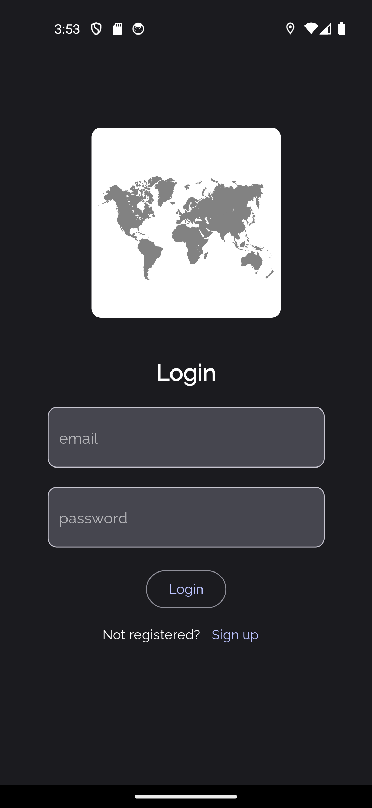
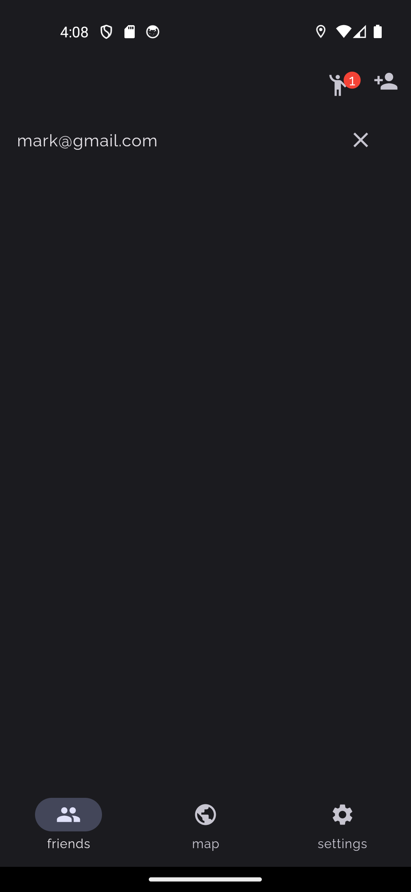
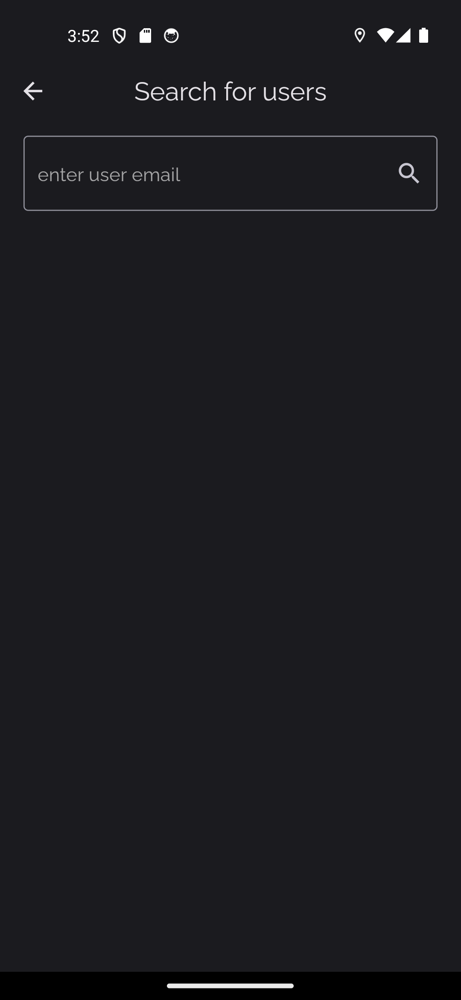
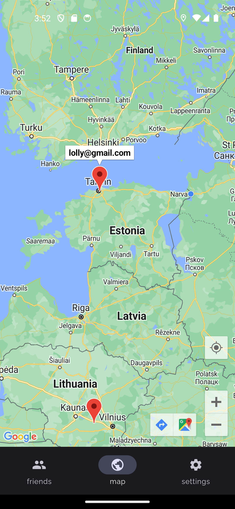
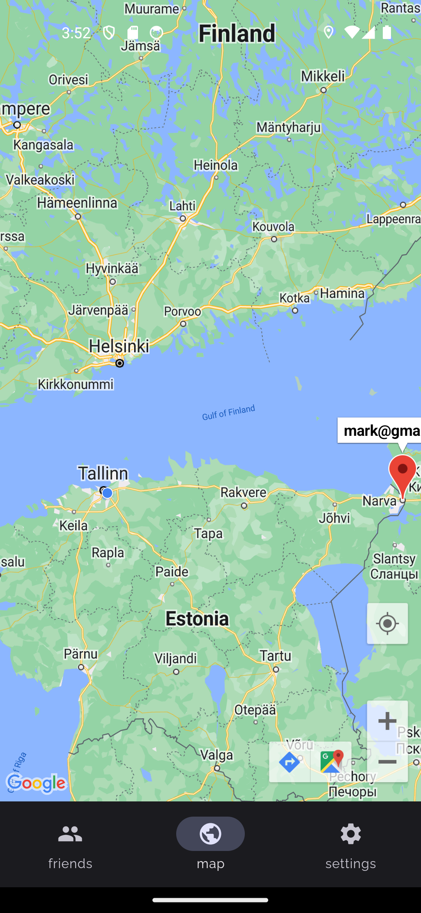

# Kaquiz (Location tracking app)

The app allows users to search for users by email, send them friendships requests and track friends last known location.

User's location is sent to database every 5 seconds.

Backend is implemented via Firebase and Frondend is done with Flutter.

## Authentication and friends

https://youtu.be/bjS1wVuu-Jc

## Locations tracking

https://youtu.be/NuBIzjuJrJs

# Technologies

- Firestore database (Firebase)
- Firebase authentication
- Google maps
- Geolocator
- State management with Provider pattern

# Run project locally

- Proceed to the official guide for flutter "Get started" https://docs.flutter.dev/get-started/install
- Clone this repo to your machine
- Run **flutter pub get**
- Run **main.dart** file with debugger (ctrl+F5 in VSCode)
- Enjoy the app (or don't enjoy)

## Screenshots

